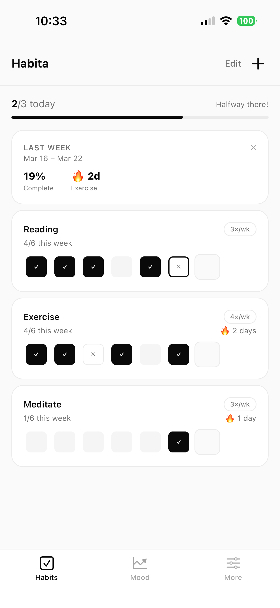
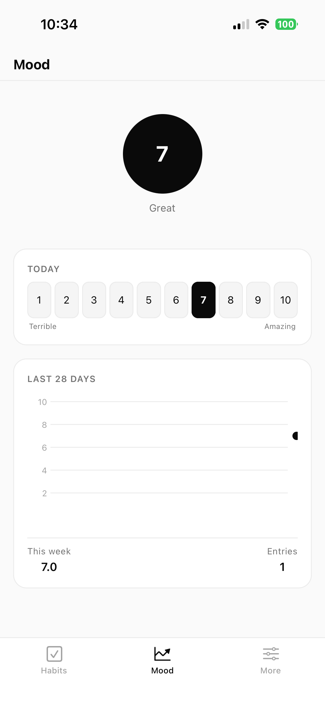
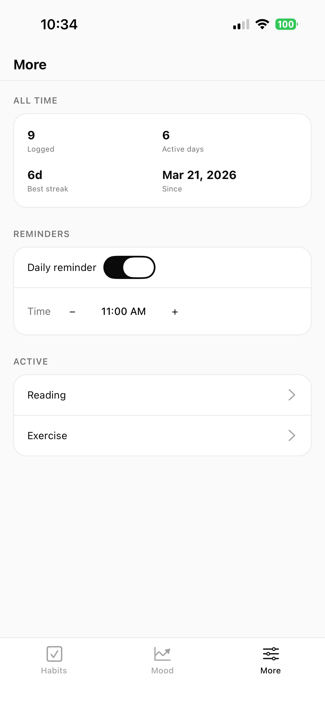

# Habita

**The habit tracker that gets out of your way.**

Habita is a minimal habit tracker with mood logging, streak tracking, and smart weekly insights. No account. No subscription. Everything stays on your device.

<p align="center">
  
  
  
</p>
## Overview

Habita is the habit tracker for people who don't need hand-holding.

No streaks hidden behind paywalls. No motivational pop-ups. No account sign-up. Just a clean, fast, privacy-first app that helps you see whether you're actually doing the things you say matter to you.

- **Track habits the right way:** Add any habit with a weekly frequency target (e.g., once a week, three times, every day). A per-habit heatmap strip shows your entire week at a glance.
- **Your mood tells the full story:** Log a daily mood score from 1–10. A rolling 28-day chart shows patterns, and the app automatically surfaces the correlation between completing your habits and how you feel.
- **Progress that means something:** Daily summaries, weekly report cards, and milestone moments (7, 14, 30, 60, 100 days) celebrated with haptic feedback.
- **A year of history, always visible:** Open any habit to see a GitHub-style 52-week heatmap of your entire year.
- **Completely private by design:** Every piece of data lives on your device in a local SQLite database. No account, no sync, no ads, no subscription.

## Features at a Glance

| Feature | Description |
| :--- | :--- |
| **Heatmap strips** | See your whole week in one row — done, skipped, or empty, at a glance. |
| **Mood + habits, correlated** | Discover whether completing your habits actually makes you feel better — backed by your own data. |
| **Streak milestones** | Hit 7, 14, 30, 60, or 100 days and feel it — a full-screen moment with haptic celebration. |
| **Weekly report cards** | Every Monday, a recap of last week's completion rate, mood average, and who's on the longest streak. |
| **52-week heatmap** | A GitHub-style full-year grid on every habit — your entire history in one screen. |
| **Day notes** | Long-press any day to add context — "skipped, travelling" or "best run in months". |
| **Daily summary bar** | One number, one bar — how many habits done today, with a live animated fill. |
| **Privacy-first** | SQLite. On-device. No account. No subscription. Your data never leaves your phone. |
| **Minimal by design** | Monochrome palette, clean typography, no dark patterns, no upsells. |

## Development

1. Install dependencies:
   ```bash
   npm install
   ```
2. Start the app:
   ```bash
   npx expo start
   ```
